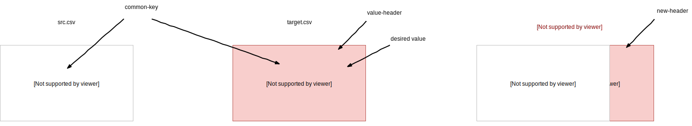

# xSniper

Just a little CSV columns and cells utility.

## Prerequisites

* [pip](https://pip.pypa.io/en/stable/)
* [virtualenv](https://pypi.org/project/virtualenv/)

## Installation

```bash
git clone git@github.com:Geoffrey42/xSniper.git
cd /xSniper
virtualenv venv
source venv/bin/activate
```

The first time, run:

```bash
pip install -r requirements.txt
```

You should now see your prompt prefixed by:

```bash
(venv) $
```

## Usage

### From command line

```text
Usage:
    xSniper cell <src.csv> <target.csv> <common-key> [--target-header=<key-header>] (<value-header> | --new-header=<name> [--output=<output.csv> | -o=<output.csv>]
    xSniper column <src.csv> <target.csv> (<target-header>... | -a | --all) [--output=<output.csv> | -o=<output.csv>]
    xSniper (--help | -h)
    xSniper (--version | -v)

Options:
    -h --help       Show this screen.
    -v --version    Show version.
    cell            if -o is present: write value found in <target.csv>
                    with content from <src.csv> under <value-header> or --new-header in <output.csv>. If not, write in <src.csv>. <common-key must be present in both *.csv files>
    column          if -o is present: write entire <target-header>'s <target.csv> in <output.csv>. If not, write in <result.csv>
```

### Examples

#### Cell mode



## Contributing

Pull requests are welcome.
For more details, please refers to our [contributing file](.github/CONTRIBUTING/contributing.md).

## License

[MIT](https://choosealicense.com/licenses/mit/)
